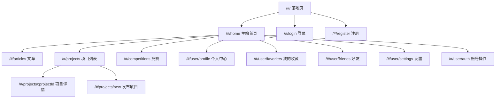
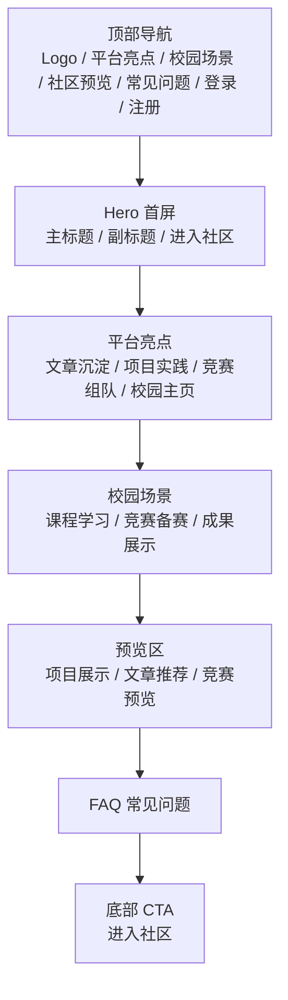
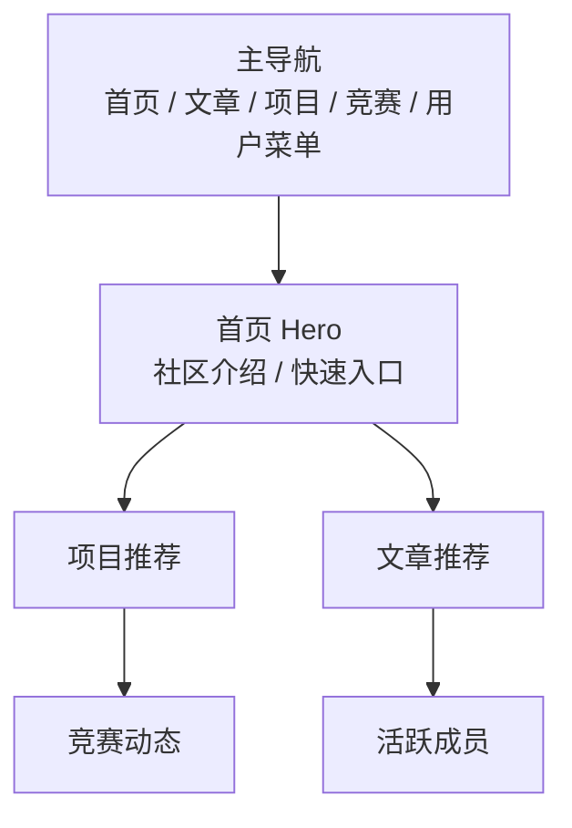
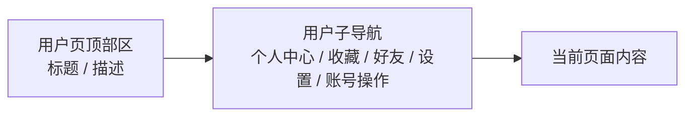
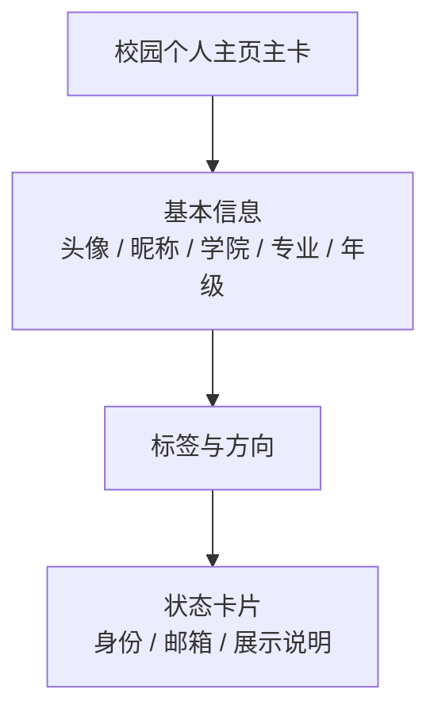
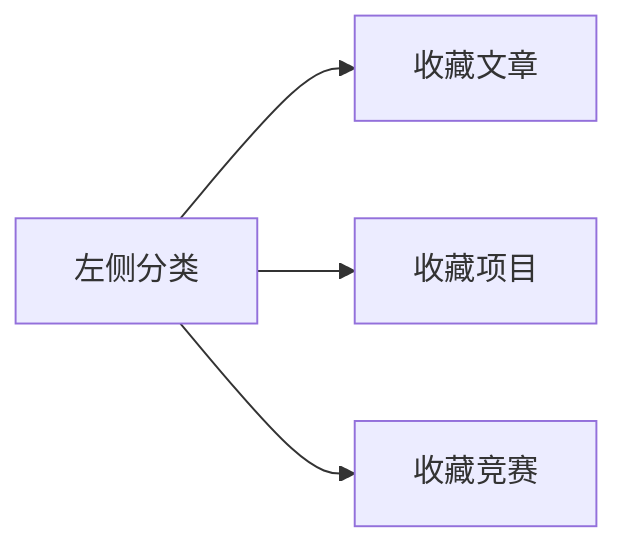
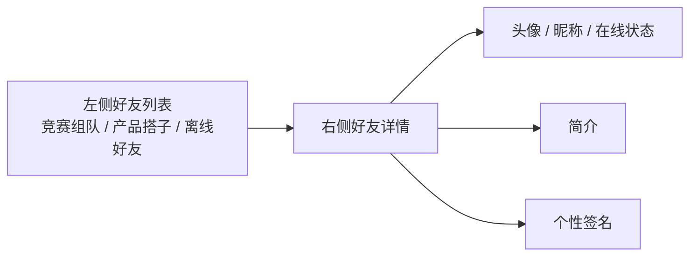
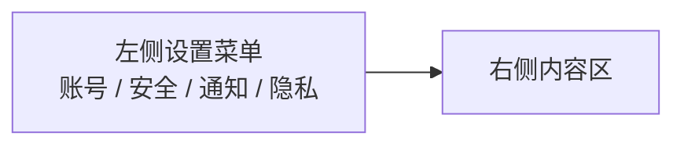
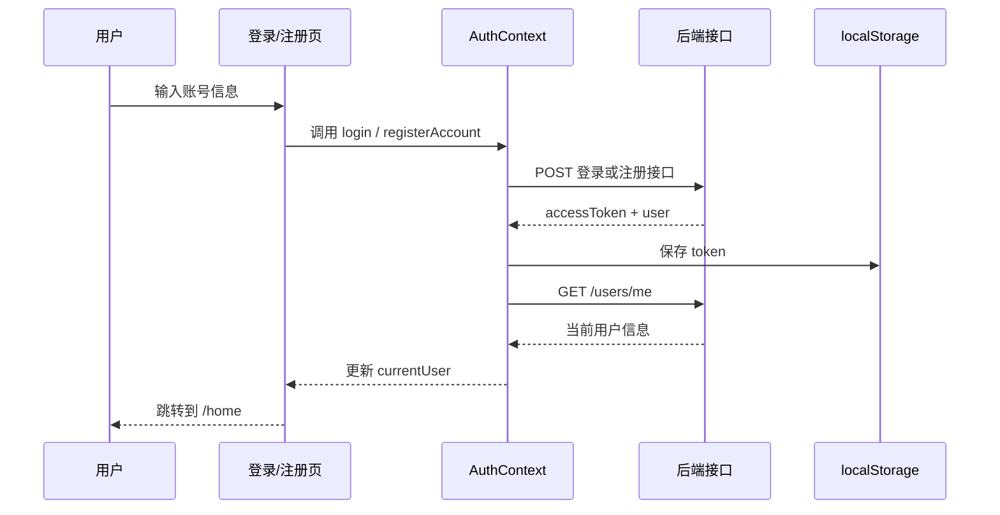

# DarkSec 前端技术汇报

## 1. 项目定位

本项目是一个基于 **南京信息工程大学校园社区** 场景构建的前端工程，当前主要包含两层：

- **落地页（Landing Page）**
  用于首次进入网站时的宣传、引导和入口展示。
- **主站（Community App）**
  用于文章浏览、项目展示、竞赛信息、用户中心与登录注册。

当前前端已完成：

- 独立落地页
- 主站首页
- 文章页
- 项目列表页
- 项目详情页
- 竞赛页
- 用户中心四大页面
- 登录 / 注册 / 当前用户信息联调

---

## 2. 技术栈总览

| 类别 | 使用内容 | 说明 |
|---|---|---|
| 开发语言 | JavaScript（ES Module） | 当前不是 TypeScript |
| 前端框架 | React 18 | 页面与组件化开发 |
| 路由 | React Router DOM 6 | 路由切换、鉴权重定向 |
| 构建工具 | Vite 5 | 本地开发、打包构建 |
| 样式方案 | Tailwind CSS 3 + 全局 CSS 变量 | 组件样式与全局主题控制 |
| 动效 | Framer Motion | 页面进入、卡片动效、菜单过渡 |
| 请求方式 | Fetch 封装 | 统一封装在 `src/api` |
| 登录态管理 | React Context | `AuthContext` 管理 token 与当前用户 |
| 主题控制 | ThemeContext | 当前已锁定固定浅色主题 |
| 包管理 | npm | `npm install / npm run dev / npm run build` |

---

## 3. 运行方式

### 本地开发

```bash
npm install
npm run dev
```

### 生产构建

```bash
npm run build
```

### 当前访问方式

项目使用的是 **HashRouter**，所以地址结构是：

- 落地页：`/#/`
- 主站首页：`/#/home`
- 登录页：`/#/login`
- 注册页：`/#/register`

---

## 4. 工程结构

```text
src
├─ api                  接口封装
├─ components
│  ├─ article           文章页相关组件
│  ├─ auth              登录注册与鉴权组件
│  ├─ home              主站首页旧拆分组件（部分可继续复用）
│  ├─ landing           落地页组件
│  ├─ layout            顶部导航、页脚、用户菜单、容器布局
│  ├─ motion            页面和区块动画
│  ├─ project           项目页相关组件
│  ├─ ui                通用 UI 组件
│  └─ user              用户相关页面布局与展示组件
├─ contexts             全局状态（登录态、主题）
├─ data                 mock 数据
├─ pages                路由页面
└─ utils                token 存储、用户数据归一化
```

---

## 5. 路由结构



### 路由入口文件

- [App.jsx](C:/Users/Lenovo/Desktop/收纳/宏图项目/devsphere/src/App.jsx)
- [main.jsx](C:/Users/Lenovo/Desktop/收纳/宏图项目/devsphere/src/main.jsx)

---

## 6. 页面板块示意图

## 6.1 落地页

文件：

- [LandingPage.jsx](C:/Users/Lenovo/Desktop/收纳/宏图项目/devsphere/src/pages/LandingPage.jsx)
- [LandingNavbar.jsx](C:/Users/Lenovo/Desktop/收纳/宏图项目/devsphere/src/components/landing/LandingNavbar.jsx)
- [HeroSection.jsx](C:/Users/Lenovo/Desktop/收纳/宏图项目/devsphere/src/components/landing/HeroSection.jsx)

示意图：



适合修改的协作方向：

- 视觉设计同学：优先改 `landing/`
- 文案同学：优先改 `LandingPage.jsx`
- 交互同学：优先改 `LandingNavbar.jsx` 和 `HeroSection.jsx`

---

## 6.2 主站首页

文件：

- [HomePage.jsx](C:/Users/Lenovo/Desktop/收纳/宏图项目/devsphere/src/pages/HomePage.jsx)
- [MainLayout.jsx](C:/Users/Lenovo/Desktop/收纳/宏图项目/devsphere/src/components/layout/MainLayout.jsx)
- [MainNavbar.jsx](C:/Users/Lenovo/Desktop/收纳/宏图项目/devsphere/src/components/layout/MainNavbar.jsx)

示意图：



说明：

- `/user/*` 页面会自动隐藏主站导航
- 首页本身是“主站首页”，不是宣传落地页

---

## 6.3 用户相关页面

### 用户页统一布局

文件：

- [UserPageLayout.jsx](C:/Users/Lenovo/Desktop/收纳/宏图项目/devsphere/src/components/user/UserPageLayout.jsx)

结构：



### 个人中心

文件：

- [ProfilePage.jsx](C:/Users/Lenovo/Desktop/收纳/宏图项目/devsphere/src/pages/ProfilePage.jsx)
- [UserProfileHero.jsx](C:/Users/Lenovo/Desktop/收纳/宏图项目/devsphere/src/components/user/UserProfileHero.jsx)

示意图：



### 我的收藏

文件：

- [FavoritesPage.jsx](C:/Users/Lenovo/Desktop/收纳/宏图项目/devsphere/src/pages/FavoritesPage.jsx)

示意图：



说明：

- 三类收藏卡片样式刻意做了区别，便于后续继续细化
- 当前收藏数据仍是 mock

### 好友页

文件：

- [FriendsPage.jsx](C:/Users/Lenovo/Desktop/收纳/宏图项目/devsphere/src/pages/FriendsPage.jsx)

示意图：



说明：

- 风格参考 QQ 好友列表
- 当前好友数据仍是 mock

### 设置页

文件：

- [SettingsPage.jsx](C:/Users/Lenovo/Desktop/收纳/宏图项目/devsphere/src/pages/SettingsPage.jsx)

示意图：



说明：

- 风格参考 Windows 设置
- 已移除主题 / 背景 / 个性化切换入口

### 账号操作页

文件：

- [AuthPage.jsx](C:/Users/Lenovo/Desktop/收纳/宏图项目/devsphere/src/pages/AuthPage.jsx)

功能：

- 退出登录
- 切换账号

---

## 7. 登录注册与鉴权结构

## 7.1 相关文件

- [AuthContext.jsx](C:/Users/Lenovo/Desktop/收纳/宏图项目/devsphere/src/contexts/AuthContext.jsx)
- [RequireAuth.jsx](C:/Users/Lenovo/Desktop/收纳/宏图项目/devsphere/src/components/auth/RequireAuth.jsx)
- [auth.js](C:/Users/Lenovo/Desktop/收纳/宏图项目/devsphere/src/api/auth.js)
- [user.js](C:/Users/Lenovo/Desktop/收纳/宏图项目/devsphere/src/api/user.js)
- [client.js](C:/Users/Lenovo/Desktop/收纳/宏图项目/devsphere/src/api/client.js)
- [authStorage.js](C:/Users/Lenovo/Desktop/收纳/宏图项目/devsphere/src/utils/authStorage.js)
- [normalizeUser.js](C:/Users/Lenovo/Desktop/收纳/宏图项目/devsphere/src/utils/normalizeUser.js)

## 7.2 鉴权流程图



---

## 8. 已对接的真实后端接口

后端地址：

- Swagger: [http://192.168.3.225:8080/swagger-ui/index.html](http://192.168.3.225:8080/swagger-ui/index.html)

当前前端已真实联调：

| 功能 | 接口 | 前端文件 |
|---|---|---|
| 注册 | `POST /api/v1/auth/register` | `src/api/auth.js` |
| 登录 | `POST /api/v1/auth/login/password` | `src/api/auth.js` |
| 当前用户资料 | `GET /api/v1/users/me` | `src/api/user.js` |

开发代理：

- [vite.config.js](C:/Users/Lenovo/Desktop/收纳/宏图项目/devsphere/vite.config.js)
- 开发环境通过 `/api-proxy` 转发到 `http://192.168.3.225:8080`

---

## 9. 仍然使用 mock 的模块

当前仍以 mock 数据为主的部分：

| 模块 | 数据来源 | 文件 |
|---|---|---|
| 收藏列表 | mock | `src/data/mockUsers.js` |
| 好友列表 | mock | `src/data/mockUsers.js` |
| 文章内容 | mock | `src/data/mockArticles.js` |
| 项目内容 | mock | `src/data/mockProjects.js` |
| 竞赛内容 | mock | `src/data/mockCompetitions.js` |

建议后续真实联调顺序：

1. 收藏接口
2. 好友接口
3. 文章列表接口
4. 项目列表 / 详情接口
5. 竞赛接口

---

## 10. 协作分工建议

## 10.1 页面协作拆分

| 协作方向 | 推荐负责文件 |
|---|---|
| 落地页视觉与宣传文案 | `src/pages/LandingPage.jsx`、`src/components/landing/*` |
| 主站导航与全局布局 | `src/components/layout/*` |
| 登录注册与鉴权 | `src/components/auth/*`、`src/contexts/AuthContext.jsx`、`src/api/*` |
| 用户中心页 | `src/pages/ProfilePage.jsx`、`src/components/user/*` |
| 收藏页 | `src/pages/FavoritesPage.jsx` |
| 好友页 | `src/pages/FriendsPage.jsx` |
| 设置页 | `src/pages/SettingsPage.jsx` |
| 文章页 | `src/pages/ArticlesPage.jsx` |
| 项目页 | `src/pages/ProjectsPage.jsx`、`src/pages/ProjectDetailPage.jsx` |
| 竞赛页 | `src/pages/CompetitionsPage.jsx` |

## 10.2 最适合你后续“定向修改”的入口

如果你要改：

- **落地页长相**：改 `src/pages/LandingPage.jsx`
- **落地页首屏**：改 `src/components/landing/HeroSection.jsx`
- **主站顶部导航**：改 `src/components/layout/MainNavbar.jsx`
- **右上角头像菜单**：改 `src/components/layout/UserMenu.jsx`
- **登录注册逻辑**：改 `src/components/auth/*` + `src/api/*`
- **用户页布局**：改 `src/components/user/UserPageLayout.jsx`
- **个人中心主视觉**：改 `src/components/user/UserProfileHero.jsx`
- **收藏分类结构**：改 `src/pages/FavoritesPage.jsx`
- **好友页社交感**：改 `src/pages/FriendsPage.jsx`
- **设置页结构**：改 `src/pages/SettingsPage.jsx`

---

## 11. 当前已知问题

这部分很重要，方便后续协作时少踩坑。

### 11.1 历史遗留文件仍存在

当前项目里还有一些旧文件或旧拆分组件，可能没有继续作为主入口使用，例如：

- `src/pages/UserCenterPage.jsx`
- `src/components/landing/LandingHeader.jsx`
- `src/components/home/*`
- `src/components/article/*`
- `src/components/project/ProjectDetailContent.jsx`

这些文件不一定都在当前主路由里使用，但还留在仓库中。  
如果团队协作前要进一步清理，建议先做一次“活跃依赖梳理”再删除。

### 11.2 部分历史文件仍可能存在中文乱码

目前工程中曾出现过字符编码问题，虽然主链路页面已经能正常使用，但仓库里仍有少数旧文件存在乱码风险。  
如果后续协作中有人接手旧组件，建议先统一做一次编码清理。

### 11.3 主题系统现在是固定主题

为了保证不同设备访问颜色一致，主题已经被固定为统一浅色风格。  
如果后续要重新支持主题切换，需要重新设计一套可控的主题策略。

---

## 12. 建议的后续迭代路线

### 第一阶段：功能稳定

- 清理历史未使用页面和组件
- 统一中文文案与编码
- 给收藏 / 好友接真实接口

### 第二阶段：协作友好

- 把 `src/pages` 和 `src/components` 中未使用文件标记出来
- 对页面拆更细的模块
- 补 README 和接口对照表

### 第三阶段：工程升级

- 视情况迁移到 TypeScript
- 引入更明确的请求状态管理
- 加入 ESLint / Prettier / Husky

---

## 13. 一句话总结

这个前端项目当前已经形成了：

- **独立落地页**
- **主站内容区**
- **拆分后的用户中心体系**
- **真实登录注册联调基础**

如果你后续要继续单人修改，重点盯住：

- `src/pages`
- `src/components/layout`
- `src/components/landing`
- `src/components/user`
- `src/api`
- `src/contexts`

如果你后续要多人协作，这份文档就可以直接作为前端分工和改动入口说明书。
